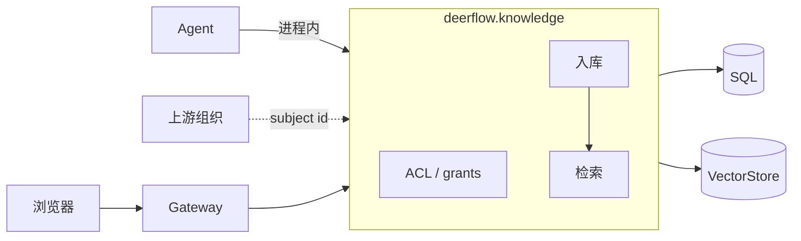
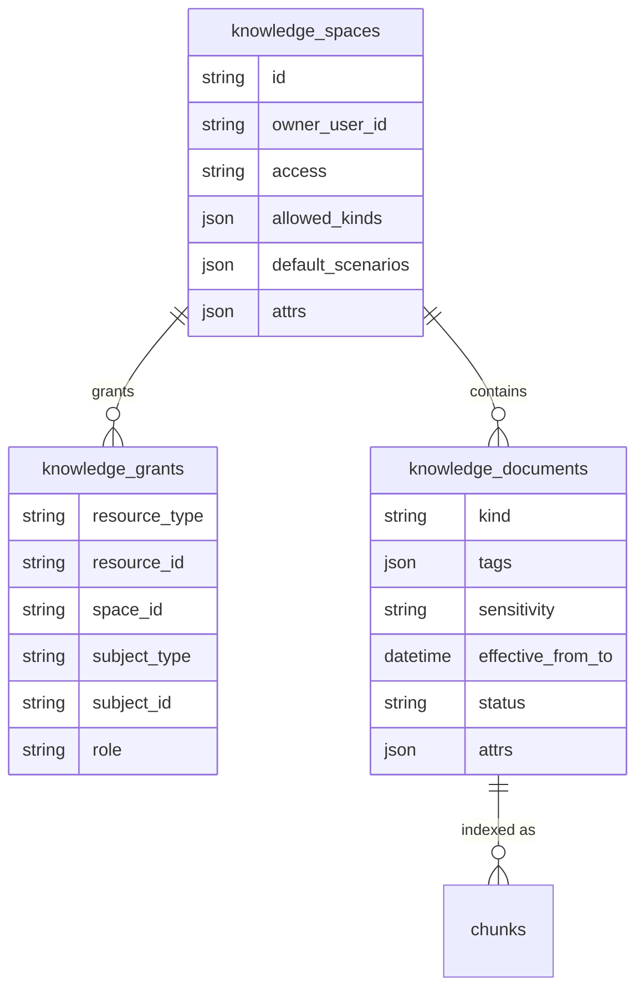

# 知识库设计（Knowledge）

> 知识模块唯一设计文档，供架构评审与开发参照。正文描述当前目标设计；与业界标杆及本仓库实现的差距见 [§9](#9-与业界差距)。

---

## 1. 模块定位

知识库为 DeerFlow 提供统一的企业知识管理能力：接收文档并完成解析、切块与索引，通过检索接口返回带来源信息的**证据（Evidence）**，供 Agent 与前端检索页使用。

在审查类场景（如制度预审）中，回答必须可追溯到具体文档片段。因此本模块不采用「将全部知识写入 prompt」的方式，而是通过**限定检索空间、按业务场景组织召回通道、在结果中附带引用信息**来保证可用性与可解释性。



### 1.1 设计原则

| 原则 | 说明 |
|------|------|
| 检索质量优先 | 采用向量与关键词混合检索，并配合重排与上下文扩展，作为默认可用基线 |
| 框架组装为主 | 解析、切块、检索、重排基于 Docling 与 LlamaIndex 实现，自研仅限薄业务编排 |
| 配置驱动扩展 | 新业务类型与检索场景通过 `kind`、`scenario`、`attrs` 与 YAML 配置扩展，避免为每种类型新增表或代码分支 |
| 权限边界清晰 | 知识 ACL 落在 `knowledge_grants`；组织主体引用上游，不自建组织表 |

### 1.2 范围外事项

以下能力不在本模块范围内实现：

- 独立知识微服务拆分
- Agent 直连向量库（须经 Service 层统一检索）
- 自研切块、BM25、OCR、重排等核心算法
- 文档类型注册表（Kind Registry）
- 组织目录本体（部门树、用户主数据）——只引用上游 subject id；授权本身由本模块管理
- 原文件的长期对象存储（当前仅在入库请求内处理字节流）

---

## 2. 架构

### 2.1 分层

| 层 | 路径 | 职责 |
|----|------|------|
| Gateway | `app/gateway/routers/knowledge.py` | HTTP 路由、登录鉴权、CSRF；不包含业务逻辑 |
| Service | `deerflow/knowledge/service.py` | 空间与文档 CRUD、检索编排、Agent 工具；HTTP 与工具共用同一入口 |
| RAG | `deerflow/knowledge/rag.py` | 文档解析、入库流水线、检索流水线（含场景通道与时效规则） |
| 持久化 | `persistence/knowledge/model.py` + VectorStore | 业务元数据存 SQL；分片与向量仅存 VectorStore |

### 2.2 关键决策

| 决策项 | 方案 | 说明 |
|--------|------|------|
| 检索策略 | Hybrid + RRF + Rerank + Parent-Child | 兼顾专有名词、条款编号等字面匹配与语义匹配 |
| 向量存储 | chroma / pgvector / milvus 可配置切换 | 兼顾本地开发与生产部署；切换向量库后需对文档重新索引 |
| 类型建模 | `kind` 字符串 + `attrs` JSON | 新领域接入无需数据库迁移 |
| 权限模型 | `access` + `knowledge_grants`；检索传入 `spaces` 后再做 ACL | 授权可运营，检索范围可收窄 |
| Agent 接入 | 进程内调用与 HTTP 相同的 `search()` | 保证工具调用与 API 检索结果一致 |

---

## 3. 权限边界

知识空间 ACL 由本模块落地：`knowledge_grants` 存授权，`resolve_space_role` 在列表、读写和检索前判定角色。

**授权主体不维护组织目录**：`knowledge_grants` 仅存上游 `subject_type`（`user` / `dept`）与 `subject_id`（不透明字符串）。用户、部门、角色语义由上游 IdP / 组织系统定义；本模块不做部门树或用户主数据同步。

| 规则（优先级自上而下） | 角色 |
|------|------|
| 系统 admin（配置允许时） | admin |
| 空间 `owner_user_id` | admin |
| `knowledge_grants` 命中当前用户 `subject_id` | grant.role |
| `knowledge_grants` 命中当前会话 `dept_ids` 中任一部门 | grant.role |
| `access=open` | viewer |
| 其他 | 不可见（列表不返回；按 id 访问返回 404） |

会话中的 `dept_ids` 由 Gateway 从上游 JWT / 会话写入 `User.dept_ids`（见 `app.gateway.auth.models.User`），不在 DeerFlow 配置或数据库中维护部门成员关系。

**管理面：** 空间 admin 通过 grants CRUD（`/workspace/knowledge/{spaceId}/grants`）维护用户/部门授权；`subject_id` 填上游 id，本模块不校验组织目录。**检索面：** `POST /search` 的 `spaces` 由调用方传入以收窄范围，但每个 space 仍须通过上述 ACL；无权空间不会进入向量检索，Agent 绑定的 `knowledge_spaces` 同理。

---

## 4. 数据模型

业务元数据使用 SQL 表（spaces / grants / documents），分片与向量存入 VectorStore。表结构定义见 `persistence/knowledge/model.py`。



| 实体 | 说明 |
|------|------|
| Space | 知识容器与检索配置单元；`attrs.knowledge_version` 记录当前发布版本标签 |
| Grant | 空间（及预留文档级）授权；`subject_type` = `user` \| `dept`，`subject_id` 为上游不透明 id；`role` = admin \| publisher \| editor \| viewer |
| Document | 各类文档共用一张表，通过 `kind`、`tags`、`attrs` 区分业务含义 |
| 分片 | 仅存于 VectorStore；metadata 含 `space_id`、`doc_id`、`kind`、`tags`、`block`、`release` 等，供检索过滤 |

---

## 5. 处理流水线

### 5.1 入库

入库在 HTTP 请求内同步完成，主路径如下：

```text
文件字节流
  → 解析（Docling；失败时降级为 MarkItDown，并记录 parse_quality）
  → 切块（IngestionPipeline，strategy=auto 按内容选型）
  → 嵌入（LlamaIndex OpenAIEmbedding / AzureOpenAIEmbedding；由 config embed.use / model 指定）
  → 写入 docstore 与 vector_store
```

同一空间内内容哈希相同的文档可去重跳过。除标题前缀、媒体清理、块类型标注等薄 Transform 外，不在本层自研解析或切块算法。嵌入与 QueryFusion LLM 直接用 LlamaIndex 适配类（改 YAML `use:`）；`qwen3-rerank` 等仍用 DashScope 专用后处理。

### 5.2 检索

```text
调用方传入 spaces（可收窄范围）
  → 逐 space ACL（resolve_space_role：owner / grants / access）
  → 混合检索（向量 + BM25）
  → 元数据过滤（空间、类型、标签、版本等）
  → 重排与父块扩展
  → 分数阈值截断
  → 按场景 lanes 分路合并（rag.resolve_lanes → merge_lane_hits）
  → 时效与条款加权（rag.rank_by_temporal）
  → 输出 Evidence（正文片段、来源、trace_id、knowledge_version）
```

新增业务检索场景时，仅需在 `config.yaml` 中增加或调整 `scenarios` 与 `lanes` 配置，无需修改检索核心代码。

---

## 6. Agent 集成

Agent 通过配置文件或 **Web UI** 声明知识空间与检索场景；Gateway 在运行时注入上下文（`setdefault`，会话显式传入的 `knowledge_spaces` / `knowledge_scenario` 优先）。`knowledge_search` 工具与 `POST /search` 共用同一检索实现，返回 Evidence 供模型引用后作答。

```text
Agent 绑库（二选一或并存）
  config.yaml: knowledge_spaces / knowledge_scenario
  Web UI: /workspace/agents/{name}/settings

运行时
  Gateway merge_run_context_overrides → inject_agent_knowledge_context
    → worker set_agent_knowledge_defaults
    → knowledge_search / POST /search → search()
    → Evidence
```

制度预审（Agent Skill + 工具，无专用 `/run` API）见 [`policy-review-design.md`](./policy-review-design.md)。

---

## 7. HTTP API

**前缀：** `/api/knowledge/v1`  
**路由实现：** `app/gateway/routers/knowledge.py`  
**请求与响应模型：** `deerflow/knowledge/service.py`

**路径约定：** 资源路径采用 REST 风格、资源名复数（如 `/spaces/me`）。

| 方法 | 路径 | 说明 |
|------|------|------|
| GET | `/health` | 健康检查 |
| GET | `/scenarios` | 配置中的检索场景 |
| GET | `/kinds` | 配置中的文档类型 |
| GET | `/spaces/me` | 当前用户可访问的空间列表（含 `my_role`） |
| POST | `/spaces` | 创建知识空间 |
| GET | `/spaces/{space_id}` | 空间详情 |
| PATCH | `/spaces/{space_id}` | 更新空间 |
| DELETE | `/spaces/{space_id}` | 删除空间 |
| GET | `/spaces/{space_id}/grants` | 列出空间授权（`subject_type` + `subject_id` + `role`） |
| PUT | `/spaces/{space_id}/grants` | 新增或更新授权（body: `subject_type` user\|dept、`subject_id`、`role`） |
| DELETE | `/spaces/{space_id}/grants/{subject_type}/{subject_id}` | 删除授权 |
| POST | `/spaces/{space_id}/documents/import` | 上传并入库 |
| GET | `/spaces/{space_id}/documents` | 文档列表（`kind`、`q`、`limit`、`offset`） |
| GET | `/spaces/{space_id}/documents/{doc_id}` | 文档详情 |
| PATCH | `/spaces/{space_id}/documents/{doc_id}` | 更新文档元数据 |
| DELETE | `/spaces/{space_id}/documents/{doc_id}` | 删除文档 |
| GET | `/spaces/{space_id}/documents/{doc_id}/chunks` | 分片预览 |
| POST | `/spaces/{space_id}/documents/{doc_id}/reindex` | 重建索引 |
| POST | `/search` | 检索，返回 Evidence |
| POST | `/eval/recall` | 召回评测 |

**错误码约定：** 依赖缺失返回 501；资源不存在返回 404；请求参数不合法返回 422。

---

## 8. 代码组织与配置

### 8.1 目录结构

知识模块已收敛为两个实现文件（历史 `lanes.py`、`temporal.py`、`tools.py` 已删除）：

```text
deerflow/knowledge/
  service.py          # Pydantic 模型、ACL、空间/文档 CRUD、search/search_lane、Agent 工具
  rag.py              # 解析/入库/检索；场景 lanes、时效规则、Evidence 打包
  __init__.py

deerflow/persistence/knowledge/
  model.py            # knowledge_spaces / knowledge_grants / knowledge_documents

app/gateway/routers/
  knowledge.py        # HTTP 薄路由

frontend/src/core/knowledge/
  api.ts, labels.ts

frontend/src/app/workspace/knowledge/
  page.tsx                          # 空间列表
  [spaceId]/page.tsx                # 文档列表（服务端 kind/q/分页）
  [spaceId]/grants/page.tsx         # 授权（user/dept 上游 id）
  [spaceId]/eval/                   # 召回评测

frontend/src/app/workspace/agents/
  [agent_name]/settings/page.tsx    # Agent 绑库 UI

frontend/src/components/workspace/
  knowledge/access-option.tsx
  knowledge/scenario-option.tsx
```

**`rag.py` 主要符号（场景与时效）：**

| 符号 | 职责 |
|------|------|
| `get_scenario_config` | 从 YAML 解析 `scenarios[]` |
| `resolve_lanes` | 将 scenario 展开为可执行 lane 列表 |
| `scenario_kind_ids` | 汇总 scenario 涉及的 kind |
| `lane_pool_k` | 单 lane 检索池大小（含 tag 放宽） |
| `merge_lane_hits` | 多 lane 结果合并（slot + RRF） |
| `evidence_dict` | 组装 Evidence 响应体 |
| `parse_as_of` / `rank_by_temporal` | 法规时效与条款锚点加权 |

**`service.py`：** HTTP 与 Agent 共用 `search()`、`search_lane()`；`knowledge_search_tool` 注册于 `config.yaml` 的 `tools[].use: deerflow.knowledge.service:knowledge_search_tool`。

配置 Schema 位于 `config/knowledge_config.py`。

### 8.2 配置项

主配置位于 `config.yaml` 的 `knowledge` 段，样例见 `config.example.yaml`。

| 配置段 | 用途 |
|--------|------|
| `parse` / `ingest` | 文档解析与切块策略 |
| `embed.use` | 嵌入模型类路径（默认 OpenAIEmbedding；Azure 用 AzureOpenAIEmbedding） |
| `retrieval.query_llm.use` | QueryFusion 改写 LLM（默认 OpenAI；Azure 用 AzureOpenAI） |
| `retrieval.rerank_use` | 重排后处理（默认 DashScope；也可用 SentenceTransformerRerank 等） |
| `vector_store.type` | 向量库类型（chroma / pgvector / milvus）；改 type 后需 reindex |
| `vector_store.connection_string` | pgvector 连接串（推荐 `$DATABASE_URL`）；也可用 host/port/user/password |
| `vector_store.uri` / `token` | Milvus 地址与可选鉴权 token |
| `vector_store.persist_dir` | Chroma 本地持久化目录 |
| `retrieval` | 混合检索、重排、top_k、分数阈值等 |
| `kinds[]` | 文档类型枚举 |
| `scenarios[]` | 检索场景及 lanes 定义 |
| `authz` | `system_admin_is_space_admin`、`allow_user_create_space`（不含组织目录） |

扩展新类型或场景时，修改 YAML 并补充前端 i18n；更换嵌入或向量库实现后，需对已有文档执行 reindex；领域专有字段优先写入 `attrs`。

### 8.3 实现约束

1. 检索在调用方传入的 `spaces` 范围内执行，且每个 space 须经本模块 ACL；无权空间不得进入向量检索。
2. 切块与检索优先使用 LlamaIndex 现有能力；嵌入 / QueryFusion LLM 用 LlamaIndex 官方适配类（OpenAI / AzureOpenAI 等），经 YAML ``use:`` 装配，不自研适配层。重排：DashScope 等用对应 LlamaIndex postprocessor。
3. 业务参数写入 YAML，界面文案写入 i18n。
4. 可选依赖缺失时返回 501，不做静默降级。

---

## 9. 与业界差距

对标 Glean / Dify·RAGFlow / Bedrock Knowledge Bases 等产品形态。当前 P0 已具备：空间与文档管理、混合检索、场景 lanes、空间级 ACL（含部门 grant）、召回评测 API、Agent 绑库（API + UI）。

### 9.1 产品体验（近期优先）— 已完成

| 能力 | 实现要点 |
|------|----------|
| Agent 绑库 UI | `/workspace/agents/{name}/settings`；`PUT /api/agents` 写 `knowledge_spaces` / `knowledge_scenario` |
| 文档列表完整分页 | `GET .../documents?kind=&q=&limit=&offset=`；前端「加载更多」 |
| 部门授权 | grants 存 `subject_type=dept` + 上游 `subject_id`；ACL 用会话 `User.dept_ids`（JWT 注入，非本地目录） |

**部门授权接入：** 管理页直接填写上游部门 id。用户所属部门由上游在登录/JWT 写入 `User.dept_ids`（`app/gateway/auth/models.py`）；Gateway 鉴权 middleware 接入 IdP 时填充该字段即可，本仓库不维护 `departments` 配置或组织表。

### 9.2 数据与运维（中期）

| 缺口 | 业界常见做法 | 本仓库现状 |
|------|--------------|------------|
| 异步入库 | 上传即返回任务 id，后台解析建索引 | HTTP 请求内同步入库 |
| 原文件存储 | 对象存储 + 预览/重下 | 请求内处理字节流，不长期保留 |
| 外部数据源 | Confluence / SharePoint / S3 等连接器与定时同步 | 仅手动上传 |
| 发版与快照 | 发布版本、回滚、审计谁改了什么 | `knowledge_version` 标签；无完整发版工作流 |
| 评测 CI | Golden recall 进流水线、回归门禁 | 有 `/eval/recall` API，未接 CI |

### 9.3 检索与权限增强（按需）

| 缺口 | 业界常见做法 | 本仓库现状 |
|------|--------------|------------|
| 文档级 ACL | 单文档授权、敏感文档隔离 | 表结构预留 `resource_type=document`，未落地 |
| 权限继承 | 组织/项目层级继承可见性 | 空间级 grants + owner/open |
| 进阶检索 | HyDE、Query 改写、多跳、图谱 | Hybrid + RRF + Rerank 基线 |
| 检索分析 | 零结果、低分、热词统计 | 无运营看板 |
| 问答工具 | 检索后直接生成带引用答案 | `knowledge_search` 返回 Evidence，无独立 QA 链 |

**建议实施顺序：** 异步入库 → 外部连接器（按业务选源）。（§9.1 产品体验项已完成。）

---

## 相关文档

- [`policy-review-design.md`](./policy-review-design.md) — 制度预审场景
- [`AUTH_DESIGN.md`](../../backend/docs/AUTH_DESIGN.md) — 全局鉴权
- `config.example.yaml` — 配置样例
