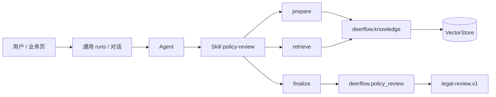
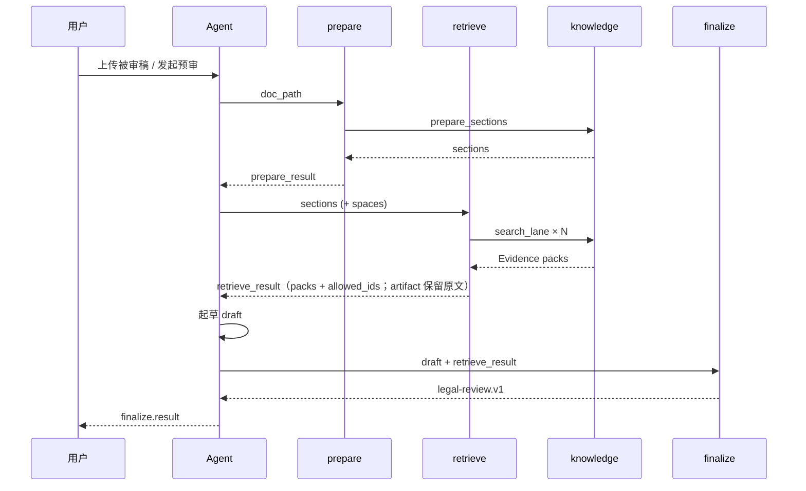

# 制度预审设计（Policy Review）

> 制度预审唯一设计文档，供架构评审与开发参照。正文描述当前目标设计；与业界差距见 [§8](#8-与业界差距)。知识入库与检索底座见 [`knowledge-design.md`](./knowledge-design.md)。

---

## 1. 模块定位

制度预审为 DeerFlow 提供**机器合规预审**能力：对被审文档按段检索企业知识（法规、公司制度、参考口径、案例），产出结构化的 `legal-review.v1` 结果（发现项、引用、报告），在对话中交付。

本模块**不是**独立业务服务，也不提供专用「一键 `/run`」HTTP 旁路。执行入口统一为框架已有路径：

```text
Web / 外部系统 → 通用 runs API（或 Agent 对话）
  → 指定 Agent（assistant_id / agent_name）
  → 加载 Skill `policy-review`
  → 调用工具 → harness 校验与渲染
```



### 1.1 设计原则

| 原则 | 说明 |
|------|------|
| 复用通用运行入口 | 聊天与业务页都走 Agent + runs；不为每种审核业务新增 `/xxx/run` |
| 依据可追溯 | 中高风险发现项的 `citations[].id` 必须落在本轮 Evidence Pack；模型不得编造引用 |
| 报告由服务端渲染 | Agent 只写 findings draft；`report` 由 `finalize` 生成，禁止信任模型手写 Markdown |
| 检索走知识模块 | 批量检索复用 `knowledge` 的 scenario / lanes / ACL；不直连向量库 |
| Skill 薄、契约厚 | Skill 只写 Must/Flow；JSON 形状与校验在 `deerflow.policy_review` |
| 一次完整交付 | 单次预审返回全部风险等级的 findings、原文锚点、依据与可执行改文案；筛选和展示不得再次调用模型 |
| 确定性写回 | Agent 只提出结构化 edit；接受、拒绝、保存、回滚与并发控制由消费结果的业务 Web 实现 |
| 契约封闭 | `extra=forbid`；`dimension.id` / `finding.id` 全局唯一；未知字段拒收 |
| 原文可回查 | retrieve 将 source 与 Evidence Pack 放入 `ToolMessage.artifact`；finalize 从本轮消息读取，不让模型回传 |

### 1.2 范围外事项

以下能力不在本模块实现：

- 专用 Gateway 路由（`/api/policy-review/v1/*`）与独立 LangGraph 编排旁路
- 独立 HITL 队列页、审计哈希链表、预审 run 持久化
- 将被审稿写入知识库（被审稿 ≠ 依据库）
- 被审稿编辑、保存、接受/拒绝状态、恢复原文、版本锁与多人协同
- `free` / `formal` 审批轮次及法务队列（由消费结果的业务系统实现）
- 组织目录、外部法务系统对接、部门专属 Agent 分叉
- 自研切块 / BM25 / 重排（检索质量由知识模块负责）

---

## 2. 架构

### 2.1 分层

| 层 | 路径 | 职责 |
|----|------|------|
| Skill | `skills/public/policy-review/` | Agent 可读 SOP（Must/Flow）；不复制契约字段表 |
| Tools | `deerflow/policy_review/tools.py` | 薄 `@tool` 包装（prepare / retrieve / finalize） |
| Pipeline | `deerflow/policy_review/pipeline.py` | prepare（Docling 分节）/ retrieve / finalize |
| Contract | `contract.py` · `validate.py` · `render.py` | `legal-review.v1` 形状、grounding、报告 Markdown |
| Flow | `deerflow/policy_review/flow.py` | 配置挂载时强制 finalize 闭环 |
| Knowledge | `deerflow/knowledge` | 空间 ACL、scenario 多 lane 检索、Evidence |
| Parse | `deerflow/utils/file_conversion.py` | Docling `parse_file_bytes`（read_file / knowledge / policy 共用） |
| 运行时 | Gateway runs + Agent | 通用 `/api/threads/.../runs` · `/api/runs`；无预审专用 API |

### 2.2 关键决策

| 决策项 | 方案 | 说明 |
|--------|------|------|
| 执行入口 | Agent + Skill + 工具 | 与框架一致；业务差异落在 Skill / 绑库 / 提示词 |
| 检索场景 | `knowledge.scenarios[].type=policy-review` | 法规 / 公司制度 / 参考 / 案例分 lane，配置驱动 |
| 输出契约 | Pydantic `legal-review.v1` | Skill 不复制字段表；校验在 harness |
| 引用规则 | 仅 `citations[].id` ⊆ Evidence Pack ids | finalize 再补全 `citable_as` / 页码等展示字段 |
| 空库策略 | 不定罪；`refusal.reason=empty_retrieval` | 禁止无依据的有罪推定 |
| 人工复核 | 结果可带 `human_review` 字段 | **无**内置 HITL 队列；高风险以 `overall_risk` 表达 |
| 前端定位 | `evidence.quote` + `section` | quote 必须是被审稿中的连续原文；Web 用 section 缩小范围后精确匹配 |
| 修改建议 | `suggestion` + `edit` | suggestion 给人阅读；edit 给 Web 确定性应用，二者不得混用 |

---

## 3. 与知识库的边界

| 关注点 | 知识库 | 制度预审 |
|--------|--------|----------|
| 文档 | 入库的法规 / 制度 / 案例等 | 被审稿（线程 uploads），**不入库** |
| 检索 | `search` / `search_lane` / Evidence | `retrieve_for_sections` 按段并行调知识检索 |
| ACL | `knowledge_grants` + 空间 access | 继承；工具侧按当前用户 ACL 过滤 |
| Agent 绑库 | `knowledge_spaces` / `knowledge_scenario` | 预审 Agent 应绑定含依据的空间；检索默认 scenario=`policy-review` |

空间授权、文档类型、入库流水线均以知识库设计为准，本模块不重复定义。

---

## 4. 输出契约（legal-review.v1）

唯一真相源：`deerflow/policy_review/contract.py`。

本节描述目标契约。`Finding.edit`（`op` + `text`）已在 `contract.py` / `validate.py` / finalize 落地；Web 侧接受写回仍由业务系统实现。

| 块 | 说明 |
|----|------|
| `dimensions[].findings[]` | 发现项：风险、置信度、原文 `evidence.quote`、建议 |
| `dimensions[].findings[].edit` | 可选的确定性改文操作；供业务 Web 接受后应用，不代表已经写回 |
| `citations[].id` | 唯一 grounding 键；须属于本轮 Evidence Pack |
| `audit` | `trace_id`、`knowledge_version`、`spaces_queried`、`pipeline_stages`、`allowed_refs` |
| `validation` | finalize 写入 pass/fail 与错误列表 |
| `report` | **仅** finalize 服务端渲染；draft 阶段禁止交付 |
| `refusal` | 空检索等拒答原因 |
| `human_review` | 可选状态字段；默认 `not_required`（无内置队列） |

目标校验规则（实现落在 `validate.py`）：

1. 中高风险且 `confidence≠low` → 必须有 citation id
2. citation id 必须 ∈ allowed_ids（Evidence Pack）
3. `evidence.quote` 必填，且必须是被审稿中的连续原文，不得改写或概括；finalize 必须从本轮 retrieve artifact 回查原文
4. `risk=high` 时 `suggestion` 必填
5. `edit.op≠none` 时 `edit.text` 必填，且 quote 在原文中必须唯一
6. 空检索时不得做有依据的定罪式结论

### 4.1 Finding 的展示字段与执行字段

一条 finding 同时服务于人读卡片和 Web 确定性操作：

| 字段 | 消费方 | 含义 |
|------|--------|------|
| `id` | Web / 业务库 | 本轮发现项唯一 id；接受/拒绝状态以此关联 |
| `section` | Web | 条款或段落提示；用于缩小 quote 搜索范围，不单独作为字符坐标 |
| `risk` / `confidence` | Web | 风险筛选、排序与置信度提示 |
| `text` | 人 | 问题标题 |
| `suggestion` | 人 | 整改说明与理由；不保证可直接替换原文 |
| `evidence.quote` | Web / 人 | 被审稿连续原文；用于定位、高亮和写回前校验 |
| `edit` | Web | 可直接应用的修改操作；不包含接受/拒绝等业务状态 |
| `citations` | 人 | 法规、制度或案例依据；draft 仅写 id，finalize 补展示字段 |

`edit` 的目标结构：

```json
{
  "op": "replace",
  "text": "我方仅在取得供应商书面授权，且授权范围明确包含模型训练用途后，方可使用相关数据。"
}
```

| 字段 | 类型 | 规则 |
|------|------|------|
| `op` | `replace \| insert_before \| insert_after \| none` | `replace` 替换 quote；insert 在 quote 前后插入；`none` 表示仅提示、不自动改文 |
| `text` | `string \| null` | `op≠none` 时为可直接写入正文的完整文本；不得写成“建议补充……”等操作说明 |

`suggestion` 与 `edit.text` 的职责必须分开：

```json
{
  "suggestion": "补充供应商授权函，明确模型训练用途。",
  "evidence": {
    "quote": "我方有权使用供应商提供的数据进行相关处理。"
  },
  "edit": {
    "op": "replace",
    "text": "我方仅在取得供应商书面授权，且授权范围明确包含模型训练用途后，方可使用相关数据。"
  }
}
```

### 4.2 Draft、finalize 工具响应与最终交付

三者不可混淆：

1. **Agent draft**：模型起草；`review_status=pending`、`validation.status=pending`，citation 只写 Evidence id，不写 `report`。跳过校验的草稿用 `review_status=draft` + `validation.status=skipped`。
2. **finalize 工具响应（服务端门禁）**：
   - 校验通过 → `Command(goto=END)` 交付完整 `result` JSON。
   - 可修复失败（schema / grounding / 解析）且未达尝试上限 → 仅 `ToolMessage`（`retry=true` + `validation.errors`），**不结束本轮、不向用户展示**，由模型修 draft 再 finalize（默认最多 3 次）。
   - 重试耗尽或缺少本轮 retrieve artifact → `Command(goto=END)` 交付 `machine_failed` JSON。
   - `draft_json` 优先为工具参数中的 JSON 对象；字符串则容错剥离 code fence / 尾部多余字符。
   - **流程硬门禁（`PolicyFlowMiddleware`）**：与 Knowledge、Memory 等内置
     Middleware 一样，由 lead agent 的组合根显式装配；仅当 `config.tools` 注册了
     `deerflow.policy_review.*` 时挂载。本轮已进入 prepare/retrieve 后：
     1. **`wrap_model_call` 强制下一步工具**（根因修复）：将 `tools` 收窄为
        `next_step`（证据就绪后仅为 `policy_finalize`），并设置
        `tool_choice=<该工具>`、关闭 `parallel_tool_calls`，禁止散文收尾或
        再调 `policy_retrieve` / 其它工具。
     2. **`after_model` 兜底**：若供应商忽略 `tool_choice` 仍输出散文，清空诊断
        文字并催促一次；催促耗尽仍不 finalize → 直接交付 `machine_failed` 的
        `legal-review.v1` 并 `jump_to=end`（永不放行 Markdown 终态）。
     流程判定限定在**当前用户轮次**，不误伤后续闲聊。
3. **对话 / runs 最终交付**：
   - **人读**：助手消息为服务端渲染的 GFM `report`（专业报表，有原文与制度依据）。
   - **机读**：`policy_finalize` 的 ToolMessage / artifact 承载完整 `legal-review.v1` JSON（含同一 `report`），供 Web 集成做筛选、定位、写回。
   - 不消费 draft、中间 retry 与模型散文。

成功交付应满足：

- `review_status=machine_passed`
- `validation.status=pass`
- `report` 已由服务端生成
- `citations[]` 已由服务端补全可展示信息
- 一次包含全部 `dimensions[].findings[]`，包括低风险项

`machine_failed` 或 `validation.status=fail` 时，Web 展示失败原因，不允许应用任何 edit。

### 4.3 最终结果示例

以下示例展示 Web 需要消费的核心字段；实际字段完整定义仍以 `contract.py` 为准：

```json
{
  "schema_hint": "legal-review.v1",
  "mode": "full",
  "overall_risk": "high",
  "review_status": "machine_passed",
  "summary": "存在训练数据授权缺口，需在送审前整改。",
  "dimensions": [
    {
      "id": "data_algo",
      "name": "数据与算法合规",
      "risk": "high",
      "findings": [
        {
          "id": "f_001",
          "section": "1.1.b",
          "risk": "high",
          "confidence": "high",
          "text": "训练数据授权链路不完整",
          "suggestion": "补充供应商授权函，明确模型训练用途。",
          "evidence": {
            "quote": "我方有权使用供应商提供的数据进行相关处理。"
          },
          "edit": {
            "op": "replace",
            "text": "我方仅在取得供应商书面授权，且授权范围明确包含模型训练用途后，方可使用相关数据。"
          },
          "citations": [
            {
              "id": "ev_88",
              "citable_as": "个人信息保护制度 / 授权条款",
              "doc_id": "doc_1",
              "page_no": 5,
              "heading_path": "数据处理 / 授权"
            }
          ],
          "parties": ["我方", "供应商"]
        }
      ]
    }
  ],
  "audit": {
    "trace_id": "tr_001",
    "knowledge_version": "kv_1",
    "spaces_queried": ["legal-statute"],
    "allowed_refs": ["ev_88"],
    "pipeline_stages": ["prepare", "retrieve", "draft", "finalize"]
  },
  "human_review": { "status": "required" },
  "validation": { "status": "pass", "errors": [], "warnings": [] },
  "report": "# 制度预审报告\n\n……",
  "refusal": null,
  "next_actions": ["补充供应商训练数据授权函"]
}
```

示例 id 和引用仅说明形状，运行时必须来自本轮文档与 Evidence Pack，不得写死。

### 4.4 Web 消费与文本匹配约束

业务 Web 收到最终结果后，应持久化该 JSON 并在本地完成筛选、接受、拒绝和保存，不得为补字段或切换风险 Tab 再次调用模型。

应用 edit 的最小流程：

1. 以 `section` 缩小正文范围，在同一份送审文本中精确查找 `evidence.quote`。
2. 命中且唯一时，按 `edit.op` 应用 `edit.text`。
3. 未命中或多处命中时，停止自动修改并要求用户确认；禁止静默替换。
4. 保存、回滚、版本冲突和多人协同由业务 Web / 文档服务处理。

被审稿必须以 Web 可复现的规范文本参与预审。若上传 DOCX/PDF 后仅对转换出的 Markdown 做预审，业务 Web 也必须使用同一规范文本定位，或自行维护从规范文本到源文档的映射；不能假设 Markdown quote 可直接定位富文本源文件。

`prepare` 产生的 sections 是内部检索中间数据，默认不对 Web 交付；最终 finding 中的 `section`、`evidence.quote` 和 `edit` 已构成最小消费契约。

---

## 5. 处理流水线

对话 / runs 中由 Agent 按 Skill 执行：

```text
prepare(doc_path)
  → policy_review.pipeline.prepare_sections（Docling + MarkdownNodeParser）
  → sections JSON（内部用）

retrieve(sections_json, spaces?)
  → 每段 section_query
  → scenario=policy-review 多 lane 并行 search_lane
  → merge_lane_hits → packs + allowed_ids
  → source sections + packs 写入 ToolMessage.artifact

Agent 起草 draft
  → findings 一次覆盖全部风险等级
  → evidence.quote 写被审稿连续原文
  → suggestion 写整改说明，edit 写可执行改文案
  → citations 只写 citations[].id；不写 report

finalize(draft_json)
  → 从本轮 retrieve artifact 读取 packs + 原文
  → 服务端 normalize（派生 dimension.risk / overall_risk 等）
  → validate（strict grounding）
  → enrich_citations / render_report（通过时）
  → Command(END) 交付完整 result JSON（pass 或 machine_failed）

对话只交付 finalize.result
```



---

## 6. Agent 集成

### 6.1 推荐配置

| 项 | 建议 |
|----|------|
| Skill | 挂载 `policy-review` |
| 工具 | `config.yaml` 注册 `policy_prepare` / `policy_retrieve` / `policy_finalize`（`group: policy_review`） |
| 知识空间 | Agent settings 绑定存放法规/制度/案例的空间 |
| 检索场景 | `knowledge_scenario: policy-review`；工具默认对齐 |

空间与场景边界由共享 `knowledge.service.search()` 统一执行：Agent 绑定是
所有知识工具的硬上限，调用参数只能缩小、不能扩大绑定范围。Skill 仅描述流程，
不承担越权防护；无 Agent 上下文的管理 API 仍按请求参数与 ACL 工作。

稳定性由 Agent 声明式装配落地：挂载 Skill `policy-review`，并用
`tool_groups: [file:read, policy_review]` 限定可用工具组（去掉 web/bash 等旁路）。
流程一旦进入 prepare/retrieve，由 `PolicyFlowMiddleware` 通过强制
`tool_choice=policy_finalize`（证据就绪后）保证必须以 finalize（或耗尽催促后的
`machine_failed`）收尾，禁止散文终态。
意图选择与工具路由交给 SOUL + Skill；契约校验与报告渲染交给
`policy_review` 工具包。不要按 Agent 显示名硬编码，也不要在 Skill 上用
`allowed-tools` 替代 `tool_groups`。

Agent 创建与绑库 UI：`/workspace/agents/{name}/settings`（见知识库设计 §6）。

### 6.2 运行时

```text
用户消息（含 uploads 路径）
  → runs（assistant_id = 该 Agent）
  → Skill 约束流程
  → prepare / retrieve / finalize（进程内工具）
  → 对话输出结构化结果
```

外部系统若需「程序化预审」，应调用**通用** `POST /api/runs/wait`（或 stream），传入同一 `assistant_id` 与任务描述 / 文件路径，而不是专用预审 API。

对线程上传文件的常见调用链为：

```text
创建或复用 thread
  → POST /api/threads/{thread_id}/uploads
  → POST /api/threads/{thread_id}/runs/wait
      assistant_id=lead_agent
      context.agent_name=<预审 Agent 名>
  → 从最终 messages 中读取 finalize.result
  → 业务 Web 持久化结果并渲染
```

上传和 run 是两个通用 API 操作；这不构成新增预审专用接口。一次 run 应返回 Web 展示所需的全部预审数据。只有用户主动“Ask AI”或明确要求重新审全文时，才发起后续 run。

### 6.3 SOUL 边界

SOUL 只写人设与话术；**不要**复制 Skill Must 或 JSON 字段表。契约以 harness + `SKILL.md` 为准。

推荐只包含：机器预审、不替代法务终裁、按 `policy-review` Skill 执行、只交 finalize result、未明确要求时不重复预审全文。字段定义、工具顺序与示例不得复制进 SOUL。

---

## 7. 代码组织与配置

### 7.1 目录结构

```text
deerflow/policy_review/
  contract.py       # legal-review.v1 Pydantic
  validate.py       # grounding / 业务规则
  render.py         # 服务端 Markdown 报告
  pipeline.py       # prepare / retrieve / finalize
  tools.py          # 薄 @tool 包装
  flow.py           # PolicyFlowMiddleware（config 挂载）
  __init__.py

skills/public/policy-review/
  SKILL.md

backend/tests/test_policy_review.py
```

**无** `service.py`、`store.py`、`persistence/policy_review`、`app/gateway/routers/policy_review.py`、前端 `/workspace/reviews`。

### 7.2 配置项

| 配置 | 位置 | 用途 |
|------|------|------|
| 工具组 | `config.yaml` → `tool_groups` | `policy_review`（与 `knowledge` 分离） |
| 工具注册 | `config.yaml` → `tools[]` | `policy_prepare` / `policy_retrieve` / `policy_finalize` 的 `use` 路径；`group: policy_review` |
| 检索场景 | `knowledge.scenarios` 中 `type: policy-review` | lanes / top_k / merge_mode / score；`fusion_num_queries: 1`（稳定召回） |
| 文档类型 | `knowledge.kinds` | 如 policy、reference、case（展示文案在前端 i18n） |

样例见 `config.example.yaml`。扩展预审检索策略时，优先改 YAML lanes，而不是新增 Python 分支。

### 7.3 实现约束

1. 交付前必须经过 `finalize`；禁止 Agent 自写 `report` 或绕过 grounding。
2. 检索必须经 knowledge Service（含 ACL）；工具不得直连 VectorStore。  
3. 被审稿仅作切段与对照原文，不得 `import` 进知识空间。  
4. `evidence.quote` 必须保持被审稿连续原文；禁止摘要、纠错或改写后再作为锚点。
5. 可自动修改的 finding 必须区分 `suggestion` 与 `edit.text`；仅建议项使用 `edit.op=none`。
6. 一次交付全部 findings；风险筛选、接受/拒绝和保存不得触发补充模型调用。
7. 不为新审核业务复制一套 Gateway pipeline；复用 Agent + Skill +（可选）新工具。

### 7.4 目标契约落地项

在业务 Web 依赖图中的「接受并应用到正文」前，DeerFlow 侧还需完成：

1. `contract.py`：为 `Finding` 增加可选 `edit` 模型与 `op` 枚举。✅
2. `validate.py`：校验 edit 操作与 text 的组合，并校验 quote 可作为原文锚点。✅
3. `SKILL.md`：要求一次交齐全部 findings，quote 使用连续原文，suggestion 与 edit 分离。✅
4. `tools.py` / finalize：保留并输出校验后的 edit；失败结果不得提供可应用 edit。✅
5. `test_policy_review.py`：覆盖合法 replace、仅提示 none、缺失 edit text 三条核心路径。✅

SOUL 无需增加 JSON 字段表，只需保持机器预审与不替代法务终裁的人设边界。

---

## 8. 与业界差距

对标企业合规预审 / Legal AI（强制引用、人工复核、审计留痕）等产品形态。

### 8.1 已具备

| 能力 | 实现要点 |
|------|----------|
| 结构化预审输出 | `legal-review.v1` + Pydantic |
| 强制 citation grounding | finalize strict；幻觉 id 拒掉 |
| 服务端报告 | `render_report` |
| 多 lane 依据召回 | scenario `policy-review` + `retrieve_for_sections` |
| Agent 一等公民接入 | Skill + 工具 + 通用 runs |
| 外部 Web 消费 | 单次完整结果；finding 提供 quote 锚点，业务 Web 自行筛选和保存 |
| 回归 | `pytest tests/test_policy_review.py` |

### 8.2 明确不做 / 已移除

| 项 | 说明 |
|----|------|
| 专用 `/run` 编排 API | 与通用 Agent 双轨，已删除 |
| Web HITL 队列 | `/workspace/reviews` 已删除 |
| 不可篡改审计表 | `policy_review_audit_events` 已删除；结果内保留轻量 `audit` 字段 |
| 文档编辑与协同 | 接受/拒绝、保存、回滚、版本锁与多人编辑由业务 Web / 文档服务承担 |

### 8.3 按需增强（应用层或后续）

| 缺口 | 建议 |
|------|------|
| 人工复核工作流 | 业务系统消费对话 / runs 结果中的高风险标记，自建审批；不回专用旁路 API |
| 预审结果持久化与审计 | 若需要，挂通用 run_events / 业务库，而非预审专用表 |
| 稳定块锚点 | 当前最小契约用 section + quote；富文本或强协同场景由业务编辑器维护 block id / CRDT 位置映射 |
| 法规冲突 / 权威源权重 | 优先在 knowledge 检索层用配置增强，预审只消费 Evidence |

**建议实施顺序：**（若业务需要）应用层 HITL → 评测用例扩展。

---

## 相关文档

- [`knowledge-design.md`](./knowledge-design.md) — 知识空间、ACL、检索、Agent 绑库
- [`AUTH_DESIGN.md`](../../backend/docs/AUTH_DESIGN.md) — 全局鉴权
- `skills/public/policy-review/SKILL.md` — Agent 运行时 SOP
- `config.example.yaml` — 工具与 `policy-review` scenario 样例
